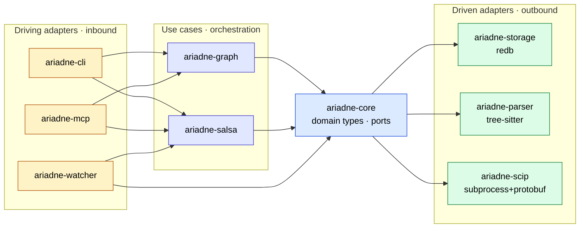

# Ariadne v1 — System Architecture

<context>
Ariadne is a local-first code-intelligence service. It builds and incrementally maintains a multi-language semantic graph of any project, persists it under `.ariadne/`, and exposes it to Claude through an MCP stdio server. v1 scope and decisions are pinned in [`.claude/plans/ariadne-core/plan.md`](../.claude/plans/ariadne-core/plan.md).
</context>

<diagram>

</diagram>

<crates>

| Crate | Role | Hexagonal position | Allowed in-workspace deps |
| --- | --- | --- | --- |
| `ariadne-core` | Domain types, IDs, port traits, pure use-case helpers | Domain interior | none |
| `ariadne-graph` | Analytics use cases (Tarjan SCC, dominators, coupling) | Use case (interior) | `ariadne-core` |
| `ariadne-salsa` | Incremental query DB; orchestrates parse → symbols → graph | Use case (interior) | `ariadne-core`, `ariadne-storage` |
| `ariadne-storage` | `redb` persistence implementing `Storage` port | Driven adapter | `ariadne-core` |
| `ariadne-parser` | tree-sitter syntactic indexing implementing `Parser` port | Driven adapter | `ariadne-core` |
| `ariadne-scip` | SCIP subprocess + protobuf decode implementing `SemanticIndexer` port | Driven adapter | `ariadne-core` |
| `ariadne-watcher` | notify-rs file watcher → `Invalidate` events | Driving adapter | `ariadne-core`, `ariadne-salsa` |
| `ariadne-mcp` | MCP stdio server exposing tools to Claude | Driving adapter | `ariadne-core`, `ariadne-graph`, `ariadne-salsa` |
| `ariadne-cli` | `ariadne` CLI binary | Driving adapter | `ariadne-core`, `ariadne-graph`, `ariadne-salsa` |
| `ariadne-e2e` | End-to-end harness against real OSS fixtures | Test crate | all (test-only) |

Adapter crates never depend on each other. The architecture invariant is enforced by `tests/architecture.rs` plus `cargo-deny` bans ([ADR-0001](adr/0001-architecture-style.md), [tier-00 plan](../.claude/plans/ariadne-core/tier-00-foundations.md)).
</crates>

<ports>
Port traits live in `ariadne-core::domain::ports`. Every row carries an explicit hexagonal role and the crate that owns the implementation (so the table alone is enough to decide where new code goes).

| Port | Role | Owning adapter | Introduced in | Sketch |
| --- | --- | --- | --- | --- |
| `Storage` | driven (outbound) — called by use cases | `ariadne-storage` (redb) | tier-02 | open/close project DB; read/write `FileRecord`, `SymbolRecord`, `EdgeRecord` |
| `Parser` | driven (outbound) — called by use cases | `ariadne-parser` (tree-sitter) | tier-03 | `parse(file_id, source) -> Cst`; incremental `reparse(prev_cst, edit) -> Cst` |
| `SemanticIndexer` | driven (outbound) — called by use cases | `ariadne-scip` (subprocess + protobuf) | tier-05 | `index(lang, project_root) -> Vec<ScipDocument>` |
| `Watcher` | driving (inbound emitter) — pushes events into use cases | `ariadne-watcher` (notify-rs) | tier-06 | `subscribe(project_root) -> Stream<Event>` |
| `Sink` | driven (outbound) — called by use cases to emit analytics output | TBD: bound in tier-08 alongside the MCP / CLI output adapters | tier-08 | placeholder until MCP response + CLI render paths land; `ariadne-mcp` and `ariadne-cli` are the candidate implementors |

Role glossary: *driven* ports are traits the domain calls (adapter side is "right" of the hexagon); *driving* ports are entry points the outside world calls or whose events flow in (adapter side is "left" of the hexagon) [src: https://alistair.cockburn.us/hexagonal-architecture/]. Concrete trait shapes are pinned in their owning tier; until then this table is the contract.
</ports>

<dataflow>
Steady-state update path:

1. `ariadne-watcher` debounces filesystem events into `Invalidate { file_id, kind }` (tier-06).
2. The event invalidates a Salsa input; Salsa re-derives parse → symbols → graph subset (tier-04, tier-07).
3. Derived deltas are written through the `Storage` port into `.ariadne/index.redb` (tier-02).
4. `ariadne-mcp` and `ariadne-cli` serve queries by reading the redb file (read txn) and walking the in-RAM `petgraph` (tier-07, tier-08, tier-10).

Cold start: open `.ariadne/index.redb` read-only, rebuild in-RAM graph from persisted edges, then service queries.
</dataflow>

<invariants>
Hard rules enforced in CI (`tests/architecture.rs`, `cargo deny check`, clippy, `cargo fmt`):

- `ariadne-core` has zero in-workspace dependencies.
- Adapter crates depend only on `ariadne-core`; never on each other.
- `src/lib.rs` is a façade — public re-exports only, no logic.
- Domain code lives under `src/domain/`; IO under `src/adapters/`; one file per external tech.
- `thiserror` enums in public API; `anyhow` allowed only inside `ariadne-cli` and `ariadne-e2e`.
- Failing test first per tier (TDD).
</invariants>

<sources>
- [Cockburn — Hexagonal Architecture (2005)](https://alistair.cockburn.us/hexagonal-architecture/)
- [How To Code It — Master Hexagonal Architecture in Rust](https://www.howtocodeit.com/guides/master-hexagonal-architecture-in-rust)
- [ADR-0001 — Architecture style](adr/0001-architecture-style.md)
- [ADR-0002 — Tech stack](adr/0002-tech-stack.md)
- [`.claude/plans/ariadne-core/plan.md`](../.claude/plans/ariadne-core/plan.md)
</sources>
