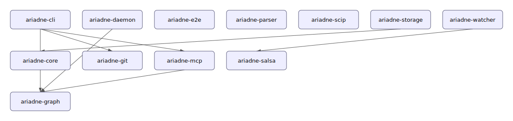

# Project Architecture Overview

## Synopsis

13 crate(s) · 3 layer(s) · 1615 source symbol(s) · 1997 dependency edge(s) · languages: typescript, rust.

## Architecture

| Crate | Layer | Role |
| --- | --- | --- |
| `ariadne-cli` | Interior | Stable foundational module — many dependents, few dependencies. |
| `ariadne-core` | Domain | Stable foundational module — many dependents, few dependencies. |
| `ariadne-daemon` | Domain | Stable foundational module — many dependents, few dependencies. |
| `ariadne-e2e` | Interior | Stable foundational module — many dependents, few dependencies. |
| `ariadne-git` | Adapter | Intermediate module — balanced inbound and outbound coupling. |
| `ariadne-graph` | Interior | Stable foundational module — many dependents, few dependencies. |
| `ariadne-mcp` | Interior | Intermediate module — balanced inbound and outbound coupling. |
| `ariadne-parser` | Adapter | Intermediate module — balanced inbound and outbound coupling. |
| `ariadne-salsa` | Interior | Intermediate module — balanced inbound and outbound coupling. |
| `ariadne-scip` | Interior | Volatile leaf module — depends outward, little depended upon. |
| `ariadne-storage` | Adapter | Intermediate module — balanced inbound and outbound coupling. |
| `ariadne-watcher` | Adapter | Volatile leaf module — depends outward, little depended upon. |
| `tools` | Interior | Intermediate module — balanced inbound and outbound coupling. |

## Boundary violations

- `accumulate` → `new` — adapter → adapter cross-crate
- `all_churn_inner` → `new` — adapter → adapter cross-crate
- `all_co_change_inner` → `new` — adapter → adapter cross-crate
- `all_symbol_churn_inner` → `new` — adapter → adapter cross-crate
- `apply_writes` → `new` — adapter → adapter cross-crate
- `ariadne_binary` → `new` — domain → adapter
- `assign_id` → `new` — domain → adapter
- `build_modules` → `new` — domain → adapter
- `build` → `all_churn` — domain → adapter
- `build` → `all_co_change` — domain → adapter
- … and 97 more.

## Cycle clusters

2 dependency cluster(s) detected.

- 22 members (`forget_file`, `symbols_for_file`, `commit_changeset`, `apply_changeset`, `upsert`, `extract` +16 more) — suggested cut: `forget_file` → `commit_changeset`
- 2 members (`default_parallelism`, `new`) — suggested cut: `default_parallelism` → `new`

## Risk hot-spots

| File | Churn | Complexity | Risk |
| --- | --- | --- | --- |
| `crates/ariadne-mcp/src/server.rs` | 11 | 148 | 0.14 |
| `crates/ariadne-parser/src/adapters/treesitter/facts.rs` | 8 | 126 | 0.09 |
| `crates/ariadne-storage/src/adapters/redb/mod.rs` | 6 | 99 | 0.05 |
| `crates/ariadne-cli/src/commands/query.rs` | 5 | 117 | 0.05 |
| `crates/ariadne-cli/src/domain/mod.rs` | 8 | 57 | 0.04 |
| `crates/ariadne-e2e/src/domain/mod.rs` | 4 | 98 | 0.03 |
| `crates/ariadne-cli/src/commands/setup.rs` | 6 | 57 | 0.03 |
| `tools/ariadne-sfc-scip/src/index.ts` | 3 | 114 | 0.03 |
| `crates/ariadne-storage/src/domain/migration.rs` | 6 | 54 | 0.03 |
| `crates/ariadne-daemon/src/adapters/ipc.rs` | 3 | 78 | 0.02 |

## Refactor & change-coupling

**God modules.** 
- `crates/ariadne-cli/src/commands/index.rs` — Ce 30, cohesion 0.14. Consider extracting `build_symbol_lines` — it accounts for 24% of this module's outbound coupling.
- `crates/ariadne-cli/src/domain/mod.rs` — Ce 35, cohesion 0.12. Consider extracting `run_index` — it accounts for 36% of this module's outbound coupling.
- `crates/ariadne-daemon/src/domain/catalog.rs` — Ce 33, cohesion 0.04. Consider extracting `build` — it accounts for 33% of this module's outbound coupling.
- `crates/ariadne-daemon/src/domain/dispatch.rs` — Ce 23, cohesion 0.00. Consider extracting `dispatch` — it accounts for 74% of this module's outbound coupling.
- `crates/ariadne-daemon/src/domain/live.rs` — Ce 26, cohesion 0.08. Consider extracting `start` — it accounts for 30% of this module's outbound coupling.
- `crates/ariadne-daemon/src/domain/queries/analytics.rs` — Ce 21, cohesion 0.25. Consider extracting `warm` — it accounts for 31% of this module's outbound coupling.
- `crates/ariadne-daemon/src/domain/queries/docs.rs` — Ce 20, cohesion 0.03. Consider extracting `doc_for` — it accounts for 54% of this module's outbound coupling.
- `crates/ariadne-daemon/src/domain/queries/health.rs` — Ce 16, cohesion 0.10. Consider extracting `weak_spots` — it accounts for 57% of this module's outbound coupling.
- `crates/ariadne-daemon/src/domain/queries/impact.rs` — Ce 28, cohesion 0.05. Consider extracting `file_summary` — it accounts for 29% of this module's outbound coupling.
- `crates/ariadne-e2e/src/domain/mod.rs` — Ce 22, cohesion 0.14. Consider extracting `verify_framework_fixture` — it accounts for 11% of this module's outbound coupling.

**Hidden change-coupling.** 
- `crates/ariadne-mcp/src/tools/mod.rs` ⇄ `crates/ariadne-mcp/tests/snapshots/handshake__tools_list.snap` — 5 shared commit(s), degree 1.00
- `crates/ariadne-cli/src/commands/setup.rs` ⇄ `crates/ariadne-cli/tests/setup.rs` — 5 shared commit(s), degree 0.91
- `crates/ariadne-mcp/src/tools/mod.rs` ⇄ `crates/ariadne-mcp/src/types.rs` — 5 shared commit(s), degree 0.83
- `crates/ariadne-mcp/src/types.rs` ⇄ `crates/ariadne-mcp/tests/snapshots/handshake__tools_list.snap` — 5 shared commit(s), degree 0.83
- `crates/ariadne-scip/src/indexer/plan.rs` ⇄ `crates/ariadne-scip/src/lib.rs` — 5 shared commit(s), degree 0.83
- `crates/ariadne-storage/src/adapters/redb/tables.rs` ⇄ `crates/ariadne-storage/tests/changeset.rs` — 5 shared commit(s), degree 0.83
- `crates/ariadne-mcp/src/server.rs` ⇄ `crates/ariadne-mcp/tests/handshake.rs` — 7 shared commit(s), degree 0.78
- `crates/ariadne-core/src/domain/ports.rs` ⇄ `crates/ariadne-storage/src/adapters/redb/mod.rs` — 5 shared commit(s), degree 0.77
- `crates/ariadne-scip/src/indexer/mod.rs` ⇄ `crates/ariadne-scip/src/lib.rs` — 5 shared commit(s), degree 0.67
- `crates/ariadne-mcp/src/server.rs` ⇄ `crates/ariadne-mcp/src/tools/mod.rs` — 5 shared commit(s), degree 0.62
